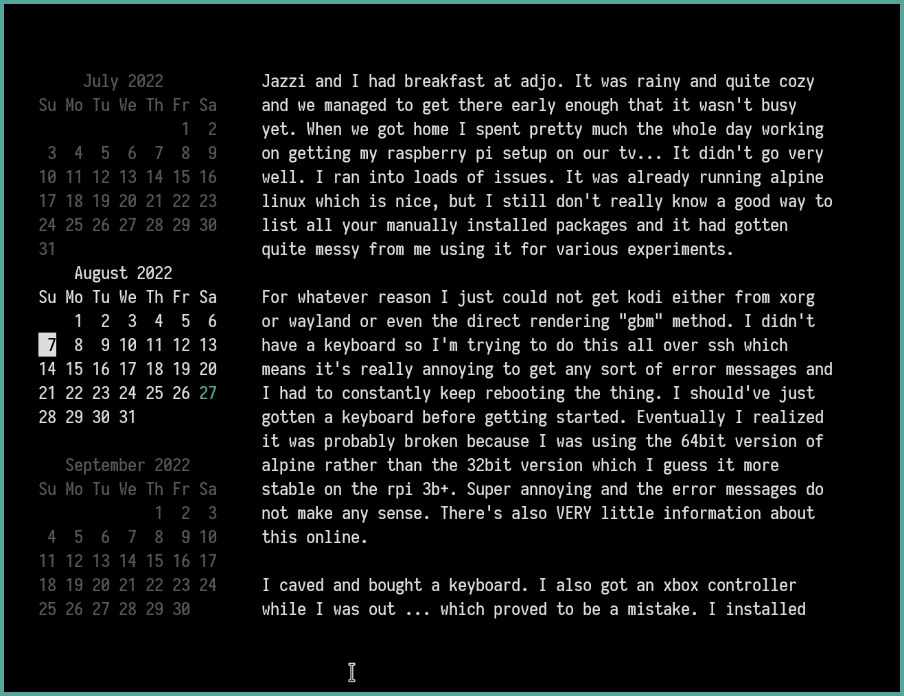

# `calendar`

A TUI version of the classic `cal` program.


## Controls
Using the arrow keys, hjkl, or the mouse you can navigate around the calendar.
Pressing tab will switch your focus to the preview window so you scroll it up
and down. Pressing enter will open the selected day's note in your editor.

## Display
The program expands to use as much terminal space as you provide. More vertical
space allows `calendar` to show the previous and next months stacked on top of
each other in a lighter grey color (configurable). The current day is shown in
green (also configurable).

If your terminal is wide enough you will see a preview window next to the month
widget(s) with the selected day's note. You can configure a path to store these
notes and press `enter` to open them in your favorite editor.

## Configuration
I've written this tool to be fairly configurable. Padding, colors, path to your
notes and of course your editor can all be configured in
`XDG_CONFIG_HOME/calendar/config.toml`. Normally, on unix systems that would be
`$HOME/.config/config.toml`. This repository contains an example config.toml
showing every option with detailed explanatory comments.

## Development
### Hot Reload
Sadly, `entr` doesn't seem to work with tui programs. So, I've been needing to
do this insane hack of having it spawn a terminal window running `go run .`
which works better than you might expect, but is still kind of annoying:
```
autostash alias rp='fd -e go | entr -r alacritty --class "Alacritty-entr,Alacritty-entr" -o window.position.x=1380 -o window.position.y=82 -e go run .'
```

# Author
Written and maintained by Dakota Walsh.
Up-to-date sources can be found at https://git.sr.ht/~kota/calendar/

# License
GNU GPL version 3 only, see LICENSE.
