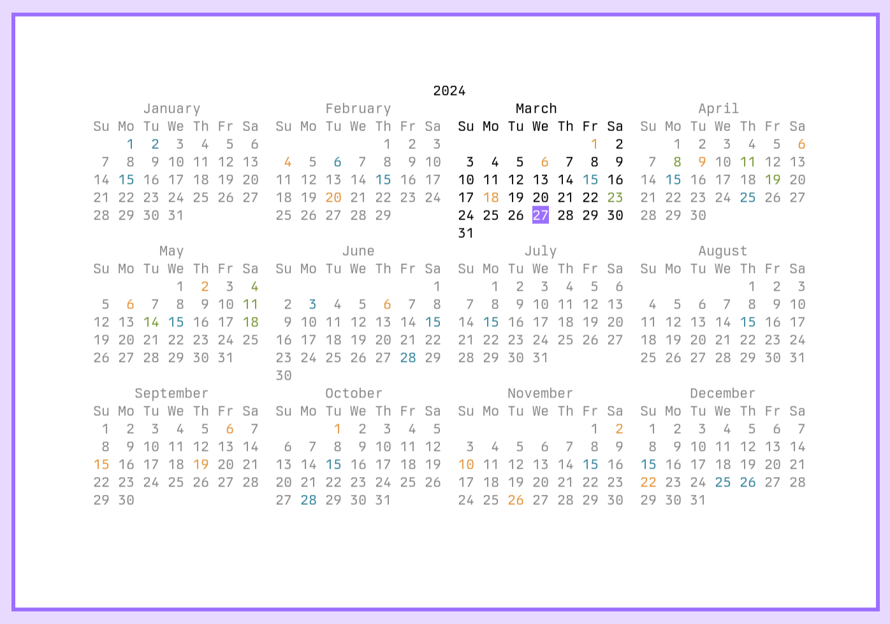
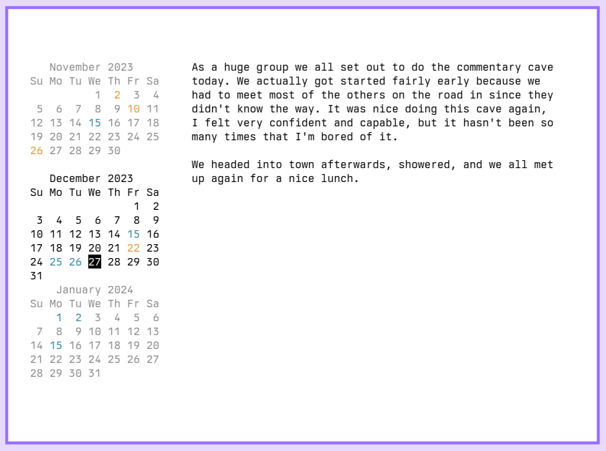

# `calendar`

A TUI version of the classic `cal` program.





## Controls
Using the arrow keys, hjkl, or the mouse you can navigate around the calendar.
Pressing tab will switch your focus to the preview window so you scroll it up
and down. Pressing enter will open the selected day's note in your editor. There
are a few other keys for things like copying the selected date to the clipboard.
Pressing ? will show a simple help menu or see `calendar(1)` for more details.

## Display
The program expands to use as much terminal space as you provide. More vertical
space allows `calendar` to show the previous and next months stacked on top of
each other in a lighter grey color (configurable). The current day is shown in
green (also configurable).

If your terminal is wide enough you will see a preview window next to the month
widget(s) with the selected day's note. You can configure a path to store these
notes and press `enter` to open them in your favorite editor.

Holidays and keywords can be configured to show certain days in different
colors. See `man 5 calendar-config` for more details.

## Build and Install
A Makefile is provided for easy installation. You can use it to tweak the
install path and compiler flags. If you know of a distrobution package get in
touch and I will add a note here.
```
make
sudo make install
```

## Configuration
I've written this tool to be fairly configurable. Padding, colors, controls,
path to your notes and of course your editor can all be configured in
`XDG_CONFIG_HOME/calendar/config.toml`. Normally, on unix systems that would be
`$HOME/.config/config.toml`. This repository contains an example config.toml
showing every option with detailed explanatory comments. Additionally, every
option is detailed in `man 5 calendar-config`.

## Development
### Hot Reload
Sadly, `entr` doesn't seem to work with tui programs. So, I've been needing to
do this insane hack of having it spawn a terminal window running `go run .`
which works better than you might expect, but is still kind of annoying:
```
autostash alias rp='fd -e go | entr -r alacritty --class "Alacritty-entr,Alacritty-entr" -o window.position.x=1380 -o window.position.y=82 -e go run .'
```

### Logging
Since `calendar` is an interactive TUI program we can't just log things to the
terminal. Instead, `export DEBUG=1`, add some `log.Println` statements, and
`tail -f debug.log` when you're running calendar to see your logs.

# Author
Written and maintained by Dakota Walsh.
Up-to-date sources can be found at https://git.sr.ht/~kota/calendar/

## Contributing
See CONTRIBUTING.md for some tips! This project is hosted on sourcehut and uses
an [email based workflow](https://git-send-email.io/).

You can just send your patches, questions, or anything else to my
[public inbox](https://lists.sr.ht/~kota/public-inbox). If you have issues
figuring it out no worries, I'm happy to help out! If you're not sure if your
patch is quite right, send it anyway and I can help clean it up.

# License
GNU GPL version 3 only, see LICENSE.
